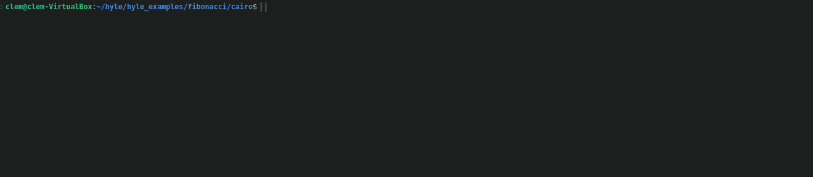
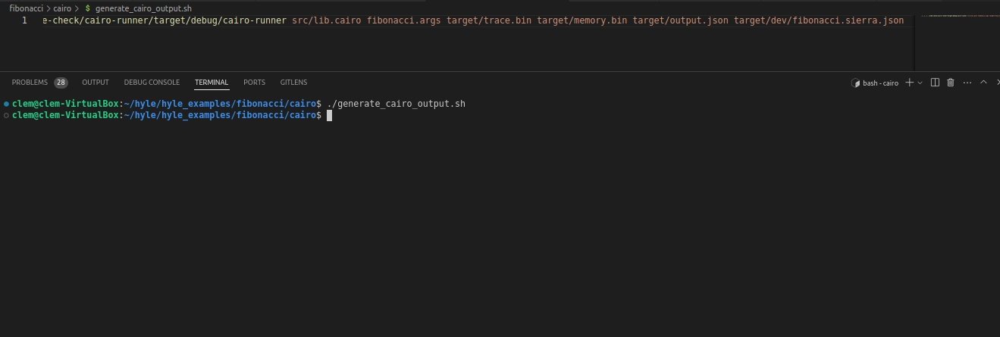
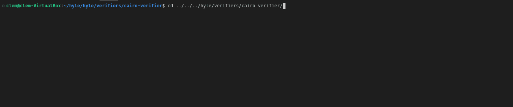
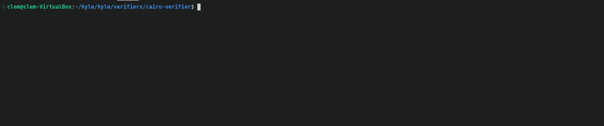
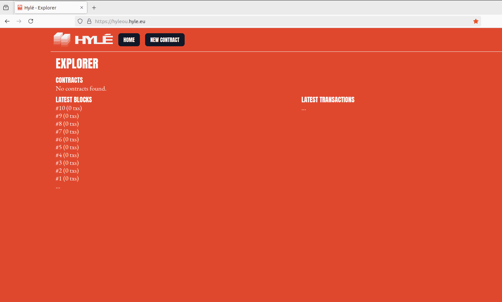
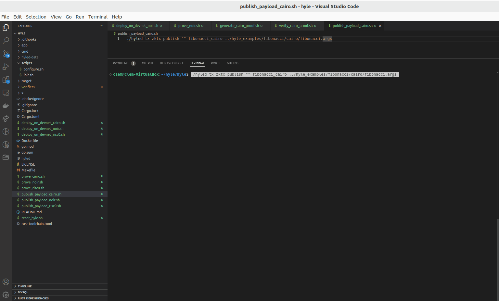
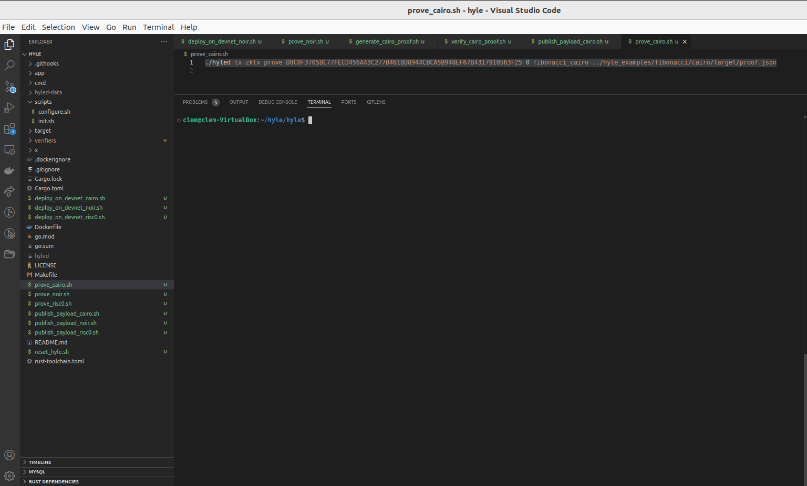

# Tooling

- Scarb installation : https://docs.swmansion.com/scarb/

# Components

Below the step to generate cairo proof for Fibonnaci Nth.

1. **fibonacci.args**
   - This file specifies which Nth Fibonacci number needs to be calculated, starting from 1 (the initial state).
   - It serves as the input for defining the desired output of the Fibonacci sequence calculation.

2. **src/lib.cairo**
   - This file defines the algorithm for calculating the Fibonacci number in the Cairo programming language.
   - It also includes logic to generate the `HyleOutput`, which is necessary for further proof and verification processes.

# Process

## Sierra file generation

Under **/cairo**

Run 
```sh
scarb build
```
File `fibonacci.sierra.json` will be generated under **target/dev/**



## Trace, memory and output generation

You will need to use the cairo runner available here https://github.com/Hyle-org/vibe-check

You may need to modify the path to cairo-runner in file generate_cairo_output.sh then

Run
```sh
./generate_cairo_output.sh
```

You should see files created under /target :
- trace.bin
- memory.bin
- output.json



## Proof generation

Clone hyle repo here : https://github.com/Hyle-org/hyle if not done already

Then under **/verifiers/cairo-verfier/**

Run
```sh
cargo run prove ../../../hyle_examples/cairo/target/trace.bin ../../../hyle_examples/cairo/target/memory.bin ../../../hyle_examples/cairo/proof.json ../../../hyle_examples/cairo/target/output.json 
```

You may need to adjust the path of :
- trace.bin
- memory.bin
- output.json

And define where to create proof.json file.



## Proof verfication - locally

Under **/verifiers/cairo-verfier/**

Run
```sh
cargo run verify ../../../hyle_examples/cairo/proof.json
```

Expected result should look similar to : 

```
{"version":1,"initial_state":[49],"next_state":[53,53],"identity":"","tx_hash":[48],"payload_hash":[7,33,217,228,108,139,149,79,94,247,128,217,122,52,188,79,117,210,250,196,66,77,71,172,87,189,2,218,156,134,62,215],"success":true,"program_outputs":[4,49,32,53,53]}
```



## Register contract on Hylé

> Note: for cairo, state_digest needs to be encoded in hex. So in our case, we want state_digest to be equals to 1 which encoded in hex is 31.
> Program id is not used for the moment, we will use 8d as example. `Cairo smart contracts will be identified by their Class Hash in the future.`

Run
```sh
./hyled tx zktx register default cairo 8d fibonacci_cairo 31
```



## Publish payload on Hylé

`lib.cairo` is hashing fibonacci number to calculate as payload. This number is defined in fibonacci.args so it can be used when publishing the payload.

Run
```sh
./hyled tx zktx publish "" fibonacci_cairo ../hyle_examples/fibonacci/cairo/fibonacci.args
```

Once executed get the transaction hash, it will be used for the proof verification.
In our example : `D8C0F3705BC77FECD456A43C277B4618D8944CBCA5B948EF67B4317910563F25`



## Prove on Hylé

Run by replacing [transaction_hash] by the one use to settle the payload : `D8C0F3705BC77FECD456A43C277B4618D8944CBCA5B948EF67B4317910563F25`
```sh
./hyled tx zktx prove [transaction_hash] 0 fibonacci_cairo ../hyle_examples/fibonacci/cairo/target/proof.json
```

If transation is successful state_digest will be updated to **next state** which is the fibonacci calcuted from fibonacci.args (10 in our example, so result expected is 55, 3535 (hex) on Hylé)



Congrats ! You're done with Cairo :clap:

