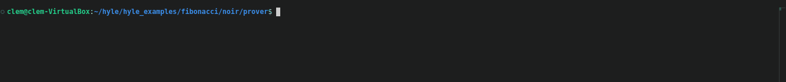
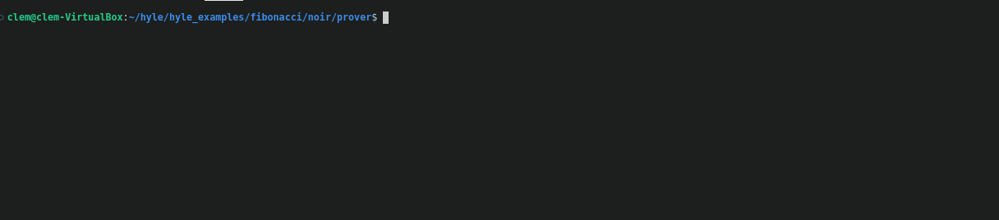
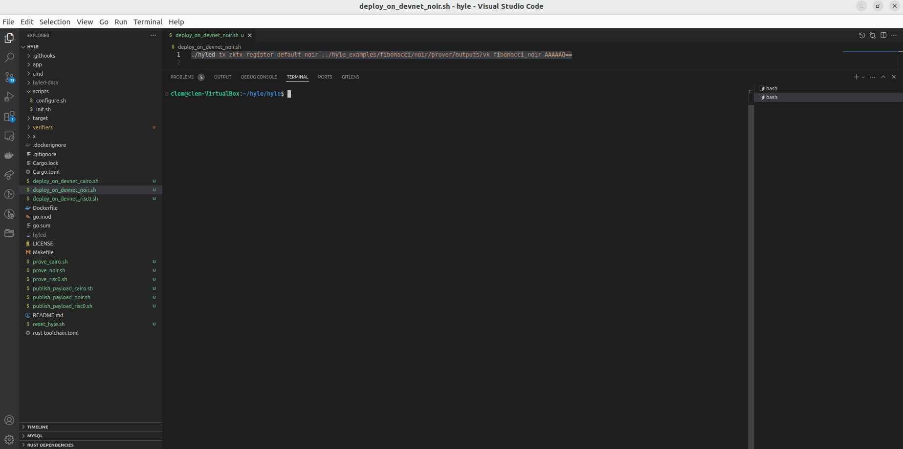
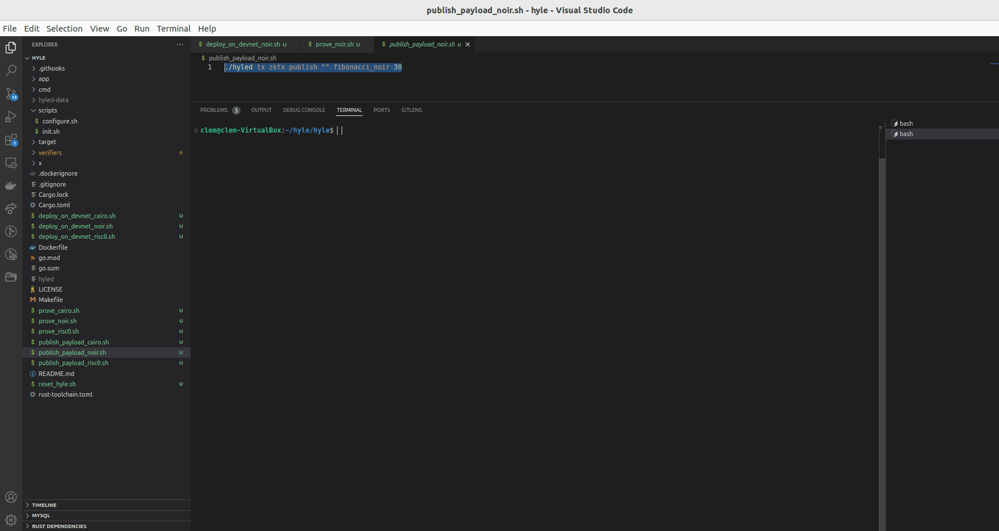
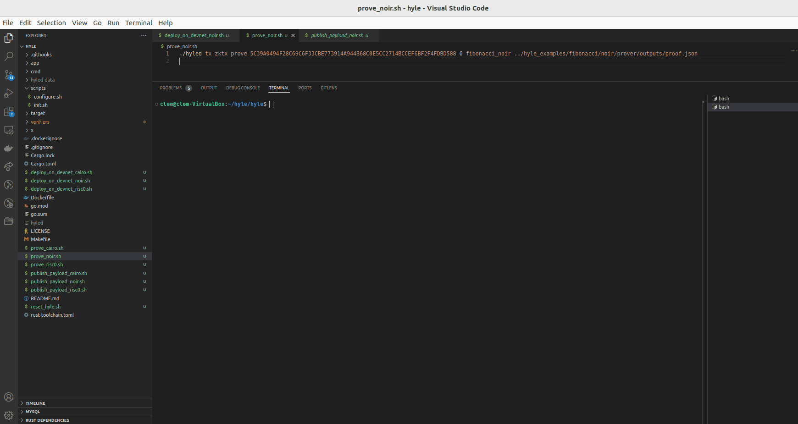

# Tooling

- **`Noir`** installation : https://noir-lang.org/docs/getting_started/installation/

    > [!NOTE]  
    >Note : Hyle verifier for noir is running with noir 0.30.0.
    >To install specific noir version:
    ```sh
    noirup --version 0.30.0
    ```

- **`Bun`** intallation : https://bun.sh/docs/installation


# Components

1. **main.nr**
   - This file is a Noir source code file that defines the logic for calculating Fibonacci numbers. Noir is a domain-specific language designed for writing zk-SNARK (zero-knowledge succinct non-interactive argument of knowledge) circuits.
   - In this context, `main.nr` is used to describe the mathematical operations and constraints needed to compute a Fibonacci sequence up to a specified number. This file is essential for generating the "circuit," which represents the computational logic of the Fibonacci algorithm in a format suitable for cryptographic proof generation.

2. **/prover/prover.ts**
   - This is a TypeScript file that handles the proof generation and verification key creation process.
   - It uses inputs, potentially provided by a user or another system, to calculate the Fibonacci sequence based on the constraints defined in `main.nr`.
   - The outputs of `prover.ts` include the proof, which is a cryptographic artifact that attests to the correctness of the Fibonacci computation, and the verification key, which is used to validate this proof.
   - These artifacts are necessary for "Hylé," to ensure that the calculation of the Fibonacci number is correct according to the input map.

# Process

## Circuit file generation (json file)

Run 
```sh
nargo compile
```

A file **fibonacci.json** will be created under **target/**

## Proof and verification key creation

Under **prover/** run

```sh
bun run prover.ts
```



You should see files created under **outputs/** :
- proof.json
- vk

## Proof verification - locally

Under **prover/** run

```sh
bun run verify.ts
```



Expect result should look similar to  : 

```
{"version":1,"initial_state":[0,0,0,1],"next_state":[0,0,0,60],"identity":"","tx_hash":[77,68,69,121,77,122,81,49,78,106,99,52,79,87,70,105,89,50,82,108,90,106,65,120,77,106,77,48,78,84,89,51,79,68,108,104,89,109,78,107,90,87,89],"payload_hash":[0,0,0,0],"success":true}
```

## Register contract on Hylé

> For noir, state_digest needs to be encoded in Base64.
> When regeristering the contract program_id will defined by verification key

Run
```sh
./hyled tx zktx register default noir ../hyle_examples/fibonacci/noir/prover/outputs/vk fibonacci_noir AAAAAQ==
```

Contract will be deployed with initial_state value = 1 (AAAAAQ==)



## Publish payload on Hylé

Run
```sh
./hyled tx zktx publish "" fibonacci_noir 30
```
>Note : 30 is for value 0 in hex encoding. 

Once executed get the transaction hash, it will be used for the proof verification.
In our example : `BF7940E995C92163AA6203BBFDE1FA0C5F12F99654AD43A97909CFDCD05B56FA`



## Prove on Hylé

Run by replacing [transaction_hash] by the one use to settle the payload : `BF7940E995C92163AA6203BBFDE1FA0C5F12F99654AD43A97909CFDCD05B56FA`
```sh
./hyled tx zktx prove [transaction_hash] 0 fibonacci_noir ../hyle_examples/fibonacci/noir/prover/outputs/proof.json
```

If transation is successful state_digest will be updated to **next state** defined in **prover.ts** and displayed in hex. In our case 60 displayed as 3c on Hylé



Congrats ! You're done with Noir :clap:


