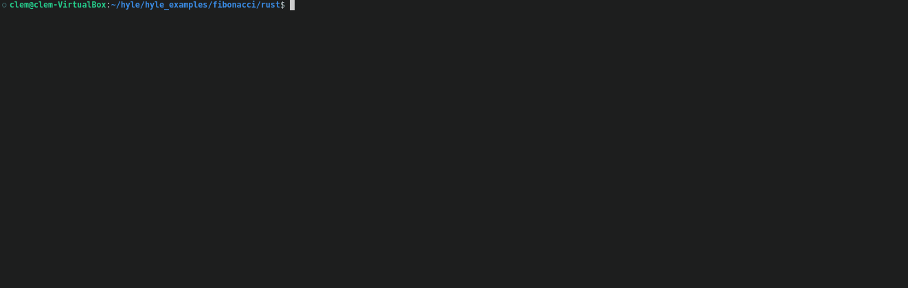
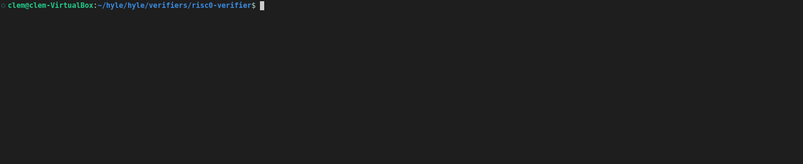
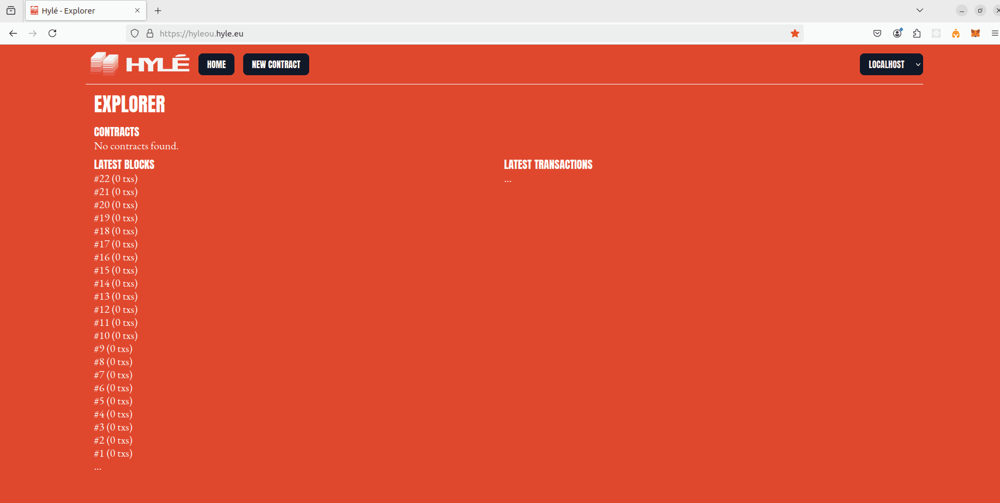
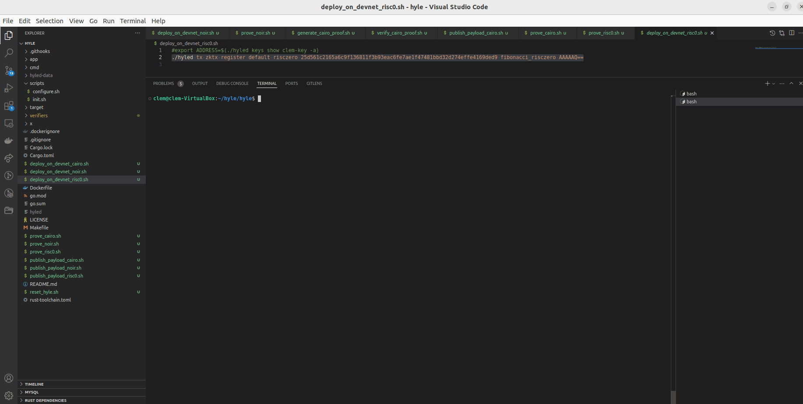
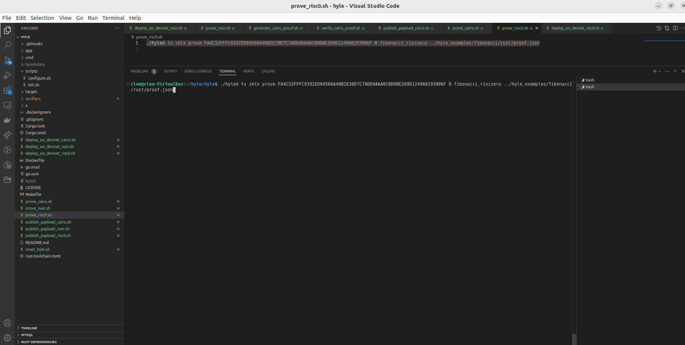

# Tooling

- Rust installation : https://www.rust-lang.org/tools/install
- To compile the program, you will need to have the RISC Zero toolchain installed check https://dev.risczero.com/api/zkvm/install

# Components

The program is implemented in rust, and compiles to the RISC Zero ZkVM.


1. **host/src/main.rs**
   - Parses CLI arguments to determine which command (Next or Reset) to execute.
   - Calls the prove function to generate a cryptographic proof based on the provided inputs.
   - Outputs the proof data to proof.json and displays relevant proof information and state transitions.

2. **methods/rust-fibonacci/src/main.rs**
   - Reads input data of type HyleInput<u32> from the zkVM environment.
   - Extracts the initial state and computes the Fibonacci number using the input value.
   - Constructs a HyleOutput structure with the computation results and commits this output to the zkVM environment.

# Process

## Build

```sh
./build.sh
```


## Proof generation

To generate the 10th Fibonacci number from  1 run

- With reproductible ELF binary

   ```sh
   cargo run -- -r next 1 10
   ```

- non-reproducibly

   ```sh
   cargo run next 1 10
   ```

   

This will output :

```sh
Method ID: Digest(25d561c2165a6c9f136811f3b93eac6fe7ae1f47481bbd32d274effe4169ded9) (hex)
Payload hash 55
proof.json written, transition from AAAAAQ== (1) to AAAANw== (55)
Program outputted "Calc done"
```
> [!NOTE]  
>A file named `proof.json` is generated and will be used later to prove computation on Hylé.

We can noticed few information :
   - Method ID `25d561c2165a6c9f136811f3b93eac6fe7ae1f47481bbd32d274effe4169ded9` which will be used later to register the contract on Hylé.
   - Inital state transition `AAAAAQ== (1)` which will set when registering contract on Hylé.
   - Next state transition `AAAANw== (55)` which will be visible on Hylé once the proof is validated.
   - Payload hash 55 which will used when publishing it.

## Proof verification - locally

Clone hyle repo here : https://github.com/Hyle-org/hyle if not done already

Then under **/verifiers/risc0-verifier/**

Run
```sh
cargo run -p risc0-verifier 25d561c2165a6c9f136811f3b93eac6fe7ae1f47481bbd32d274effe4169ded9 ../../../hyle_examples/fibonacci/rust/proof.json
```

Expected result should look similar to : 

```
{"version":1,"initial_state":[0,0,0,1],"next_state":[0,0,0,55],"identity":"","tx_hash":[1],"payload_hash":[0,0,0,55],"success":true,"program_outputs":null}
```


## Register contract on Hylé

- Risc Zero smart contracts are identified by their image ID. Two identical programs will have identical image IDs.
- State digest is our initial value : AAAAAQ== (1)

Run
```sh
./hyled tx zktx register default risczero 25d561c2165a6c9f136811f3b93eac6fe7ae1f47481bbd32d274effe4169ded9 fibonacci_risczero AAAAAQ==
```

Contract will be deployed with state_digest value = 1 (AAAAAQ==)



## Publish payload on Hylé

Run
```sh
./hyled tx zktx publish "" fibonacci_risczero AAAANw==
```
>Value AAAANw== is the payload hash value (55) encoded in base64

Once executed get the transaction hash, it will be used for proof verification. 
In our example : `FA4C32FFFC9392ED04566A40B2E38D7C7AD69AAA0CBDDBE269D1249A8193906F`



## Prove on Hylé

Run by replacing [transaction_hash] by the one use to settle the payload : `FA4C32FFFC9392ED04566A40B2E38D7C7AD69AAA0CBDDBE269D1249A8193906F`
```sh
./hyled tx zktx prove [transaction_hash] 0 fibonacci_risczero ../hyle_examples/fibonacci/rust/proof.json
```

If transation is successful state_digest will be updated to **next state** value AAAANw== (55).



Congrats ! You're done with Risc0 :clap:

